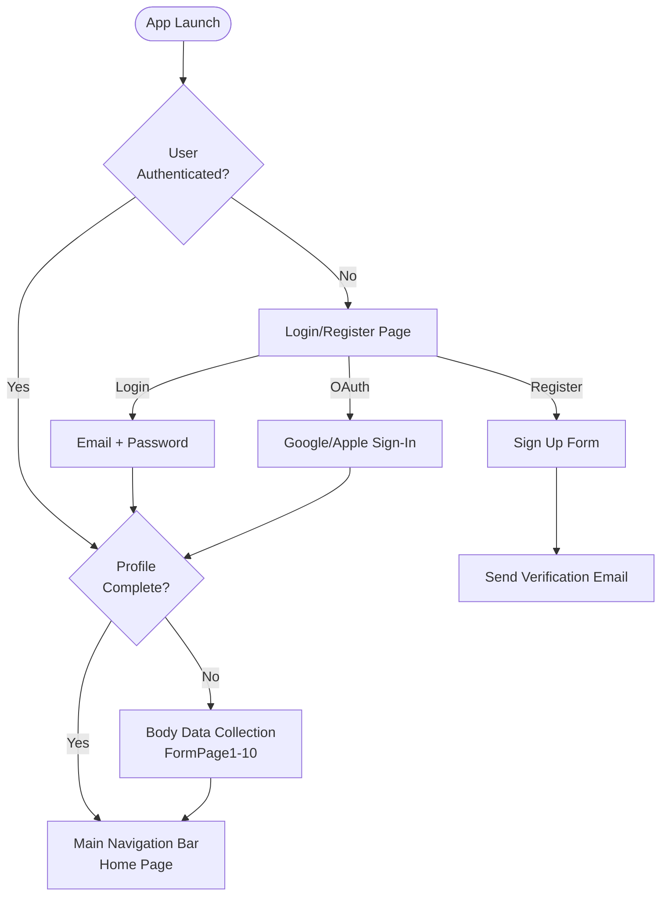
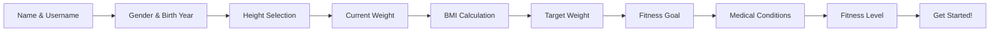
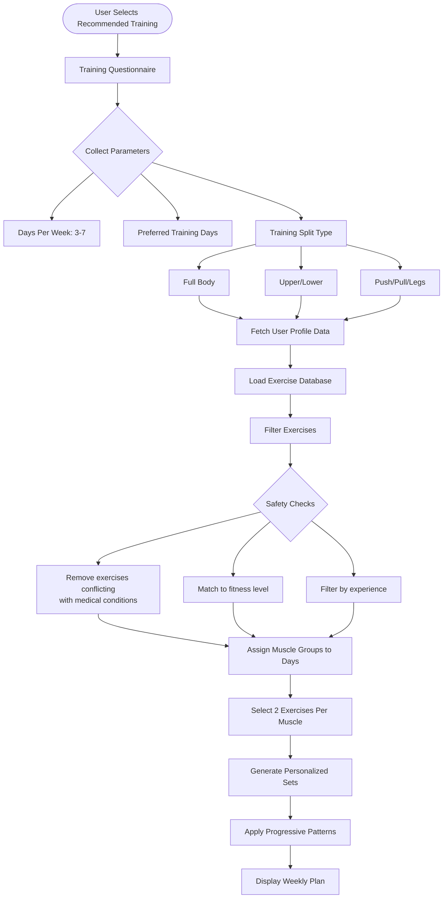
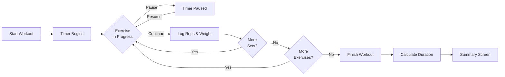
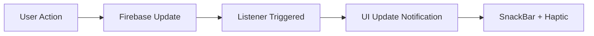
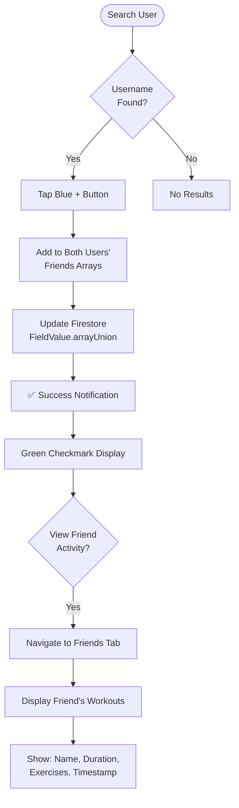

# GymFit 

A comprehensive mobile fitness application that empowers users to take control of their health through personalized workout plans, detailed exercise demonstrations, progress tracking, and social fitness features.

[](https://flutter.dev)
[](https://firebase.google.com)
[](https://github.com)

## 🎯 Project Overview

**Team Name:** Rise and Grind  
**Project Level:** Apollo 11 (Advanced)  
**Development Period:** May - August 2025

GymFit addresses a critical health challenge: According to WHO 2022 statistics, over 1 billion people worldwide are living with obesity (1 in 8 individuals). Our research with university students revealed:

- **40%** lack knowledge on gym equipment usage
- **30%** lack motivation and interest
- **20%** cite time constraints due to academic stress
- **10%** face accessibility issues

GymFit provides the solution through expert guidance, customized workout plans, and comprehensive progress tracking.

---

## 🚀 Quick Start

### 📱 Deployment Options

#### For iOS Users (Web Version)
Since iOS App Store deployment requires paid Apple Developer membership, we've deployed a Flutter web application:

**Live Demo:** [https://wangzx2001.github.io/Gymfit-webapp/](https://wangzx2001.github.io/Gymfit-webapp/)
<p align = "center">

</p>
*Tip: Resize your browser to phone dimensions for optimal experience*

#### For Android Users

**Option 1:** Access the web app (same as iOS)

**Option 2 (Recommended):** Download the native APK  
[Download APK](https://drive.google.com/file/d/1OXO7VnW7myLux1Y4_kUayY0JgSqrGf1m/view?usp=sharing)  
*Remember to enable "ALLOW DOWNLOAD" in your settings*

### 🔐 Account Registration

For security purposes, each user must register with a **unique email address** as their username.

**Recommended format:** `yourname@gmail.com` (e.g., `wangzaixi@gmail.com`)  
**Test password:** `123456`

---

## ✨ Core Features

### 🔑 1. User Authentication System



**Features:**
- 🔐 Email/Password authentication with Firebase
- 🌐 Google Sign-In integration (Apple Sign-In planned)
- ✉️ Email verification for security
- 🛡️ Password strength validation (minimum 6 characters)
- 🚫 Duplicate email prevention
- 📱 Responsive error handling with clear user feedback

**Security Enhancements:**
- Generic error messages prevent email enumeration attacks
- Firebase Authentication backend validation
- Session state management with persistent login

---

### 📊 2. Comprehensive Body Information Collection

**10-Step Guided Onboarding Process:**



**Data Collected:**
- 👤 Personal Info: Name, username, gender, age
- 📏 Physical Metrics: Height (cm), current weight (kg), target weight
- 🎯 Fitness Goals: Lose weight, gain muscle, endurance, strength
- 🏥 Medical History: Pre-existing conditions for safe recommendations
- 💪 Experience Level: Beginner, intermediate, advanced

**Smart Features:**
- **Automatic BMI Calculation:** `BMI = Weight / (Height in meters)²`
- **Color-Coded Feedback:**
  - 🔵 Blue: Underweight
  - 🟢 Green: Normal (You're in good shape!)
  - 🟠 Orange: Overweight
  - 🔴 Red: Obesity (Time for healthier lifestyle)
- **Weight Difference Tracker:** Visual display of progress toward target weight
- **Dual-Scroller Weight Input:** Separate whole number (1-200) and decimal (0.0-0.9) for precision
- **Back Navigation:** Edit previous inputs with temporary data retention

**Firebase Database Schema:**
```javascript
users/{userId} {
  name: "John Doe",
  username: "johndoe123",
  age: 25,
  gender: "Male",
  height: 175,
  startingWeight: 80,
  targetWeight: 70,
  BMI: 26.1,
  goal: "Lose Weight",
  fitnessLevel: "Intermediate",
  medicalConditions: ["None"]
}
```

---

### 💪 3. Smart Workout Planning System

#### Exercise Information Database

**📚 Comprehensive Exercise Library**
- **200+ Exercises** categorized by:
  - 🎯 Main Muscle Groups: Chest, Back, Arms, Legs, Core
  - 🔧 Secondary Muscles: Biceps, Triceps, Quads, etc.
  - 🏋️ Equipment: Barbell, Dumbbell, Machines, Cables, Bodyweight
  - 📈 Experience Level: Beginner, Intermediate, Advanced

**Search & Filter System:**
```
┌─────────────────────────────────────┐
│  🔍 Search Bar (Real-time)          │
│  🎚️ Filter Icon                     │
└─────────────────────────────────────┘
         ↓
┌─────────────────────────────────────┐
│  Filter By:                          │
│  ☑️ Main Muscles                    │
│  ☑️ Secondary Muscles               │
│  ☑️ Experience Level                │
│  ☑️ Equipment Type                  │
│  [Apply Filters]                     │
└─────────────────────────────────────┘
```

**Exercise Detail Page:**
- 📹 Embedded YouTube video demonstrations (via `youtube_player_flutter`)
- 📝 Step-by-step "How to Perform" instructions
- 💡 Pro tips with lightbulb icon
- 🎨 Color-coded experience level badges
- ➕ "Add to Workout Plan" button
- 🎮 Custom video controls: Replay 10s, Play/Pause, Forward 10s, Fullscreen

#### Workout Modes

**🏃 Quick Start**
- Instant workout session creation
- Add exercises on-the-fly
- Real-time rep and weight logging
- Checkbox completion tracking

**🤖 AI-Powered Recommended Training**

The crown jewel of GymFit - a sophisticated recommendation engine that generates personalized workout plans.

**Algorithm Flow:**


**Rep & Set Calculation Algorithm:**

| **Fitness Goal** | **Base Reps** | **Modifier** | **Final Range** |
|------------------|---------------|--------------|-----------------|
| Lose Weight      | 15            | Exercise type × Level | 12-20 reps |
| Gain Muscle      | 10            | Exercise type × Level | 8-12 reps |
| Endurance        | 20            | Exercise type × Level | 15-25 reps |
| Strength         | 6             | Exercise type × Level | 4-8 reps |

**Exercise Type Modifiers:**
- Compound (Squat/Deadlift): ×0.8
- Press/Row: ×0.9
- Bodyweight: ×1.2
- Isolation (Arms): ×1.1

**Fitness Level Modifiers:**
- Beginner: ×1.1 (more reps, lighter weight)
- Intermediate: ×1.0
- Advanced: ×0.9 (fewer reps, heavier weight)

**Set Progression Patterns:**

| **Goal** | **Pattern** | **Example (3 Sets)** |
|----------|-------------|----------------------|
| Lose Weight | Reverse Pyramid (-2.5kg, +2 reps) | 20kg×15 → 17.5kg×17 → 15kg×19 |
| Gain Muscle (Beginner) | Consistent | 30kg×10 → 30kg×10 → 30kg×10 |
| Gain Muscle (Advanced) | Progressive (+2.5kg, -1 rep) | 30kg×10 → 32.5kg×9 → 35kg×8 |
| Endurance | Consistent | 15kg×20 → 15kg×20 → 15kg×20 |
| Strength | Heavy Progressive (+5kg, -2 reps) | 50kg×6 → 55kg×4 → 60kg×2 |

**Example Output:**
```
User: Intermediate, Gain Muscle, Bench Press
→ Reps: 10 × 0.9 (Press) = 9 reps
→ Sets: 4 sets
→ Pattern: 30kg×9 → 32.5kg×8 → 35kg×7 → 37.5kg×6
```

**💾 Custom Workout Plans**
- Create and save personalized routines
- Reusable templates for consistency
- Edit and duplicate past workouts

---

### ⏱️ 4. Advanced Workout Timer & Rep Tracking

**Real-Time Session Management:**



**Key Features:**
- ⏱️ **Global Timer:** Persists across screen transitions
- 📱 **Minibar Display:** Floating timer below navigation bar
- ⏸️ **Pause/Resume:** With visual icon indicators
- ✅ **Set Completion Tracking:** Green highlight on checkboxes
- ✏️ **Editable Workout Name:** Tap pencil icon to customize
- 🎯 **Progress Indicators:** "1/3 sets completed"
- ➕ **Dynamic Exercise Addition:** Add more exercises mid-workout

**Input Features:**
- 🔢 Dual TextFormField for weight (kg) and reps
- 📝 Auto-select all text on tap for quick editing
- 🎹 Input validation (numeric only, 2 decimal places for weight)
- ➕ Add/remove sets with plus/minus buttons
- 💾 Real-time data persistence to Firebase

---

### 🔥 5. Scientific Calorie Calculation

**MET-Based Algorithm:**

**Formula:**
```
Calories Burned = MET × Weight (kg) × Duration (minutes) / 60
```

**MET Value Table:**

| **MET Range** | **Intensity** | **Exercises** | **Calorie Burn** |
|---------------|---------------|---------------|------------------|
| 4.0-4.2 | Medium-High | Lat Pulldown, Seated Cable Row, T-Bar Row | High |
| 3.8 | Medium-High | Bench Press (Barbell/Dumbbell), Overhead Press | High |
| 3.5 | Medium | Lateral Raise (Dumbbell/Barbell) | Medium-High |
| 3.2 | Medium | Chest Fly (Cable/Dumbbell) | Medium |
| 3.0 | Low-Medium | Bicep Curls, Tricep Extensions | Medium |

**Intensity Multipliers:**
- **Heavy Weight** (1.3× body weight ratio): ×1.3
- **Medium Weight** (1.2× body weight ratio): ×1.2
- **Light Weight** (1.1× body weight ratio): ×1.1

**Example Calculation:**
```
User: 70kg, 45-minute workout
Exercise: Bench Press (MET 3.8), Heavy weight (×1.3)

Calories = 3.8 × 70 × (45/60) × 1.3
         = 3.8 × 70 × 0.75 × 1.3
         = 259 calories
```

**Display:**
- 🔥 Animated calorie counter on workout summary
- 📊 Historical calorie tracking in history tab
- 📈 Weekly/monthly calorie burn graphs

**Testing Results:**
- 17 comprehensive test cases conducted
- Success rate: 47.1% (8/17 passed)
- **Known Issue:** Algorithm systematically underestimates by 40-65%
- **Planned Fix:** Recalibrate MET values and intensity multipliers

---

### 📜 6. Comprehensive Workout History

**Three-View System:**

#### 📋 List View
```
┌─────────────────────────────────────┐
│  Morning Workout                     │
│  📅 May 15, 2024 • ⏱️ 08:30 AM      │
│  ⏰ 45:23 • 💪 6 exercises • ✅ 18 sets│
│  Preview: Bench Press, Squats, ...   │
└─────────────────────────────────────┘
```

**Features:**
- Tap to view full details
- Long-press for quick preview dialog
- Pull-to-refresh for latest data
- Real-time Firebase stream updates

#### 📅 Calendar View
```
┌─────────────────────────────────────┐
│         May 2024                     │
│  S  M  T  W  T  F  S                │
│           1  2  3  4                │
│  5  6  🔵 8  9 🔵 11               │
│ 12 🔵 14 15 🔵 17 18               │
└─────────────────────────────────────┘

Current Streak: 🔥 5 days
Longest Streak: 🏆 12 days
```

**Features:**
- Visual workout day markers
- Tap date to see that day's workouts
- Streak calculation algorithm
- Multiple calendar formats (month/week/2-week)

#### 🔍 Detailed View
- Exercise-by-exercise breakdown
- Set-level data (weight × reps)
- Completion status per set
- Duration and calories burned
- Delete workout with confirmation dialog

**Firebase Structure:**
```javascript
workouts/{workoutId} {
  userId: "user123",
  name: "Morning Workout",
  date: Timestamp,
  duration: 2723, // seconds
  caloriesBurned: 245,
  exercises: [
    {
      name: "Bench Press",
      sets: [
        { weight: 60, reps: 10, completed: true },
        { weight: 65, reps: 8, completed: true }
      ]
    }
  ]
}
```

---

### 🔔 7. Smart Notification System

**Multi-Layer Notification Strategy:**

#### SnackBar Notifications (Immediate Feedback)
```dart
✅ "Friend added successfully!"
✅ "Calorie entry added successfully!"
✅ "Workout saved!"
❌ "Failed to load workout data"
⚠️ "Invalid input - weight must be positive"
```

#### Dialog Notifications (Important Actions)
- 🎉 **Achievement Celebrations:** Water goal completion
- ⚠️ **Confirmations:** Friend removal, workout deletion
- 🚨 **Critical Errors:** Network issues, data sync failures

**Smart Logic:**
- **One-time-per-day alerts:** Water goal achievement uses SharedPreferences
- **Haptic feedback:** Light vibration for friend additions, selection clicks
- **Pull-to-refresh indicators:** Visual loading states

#### Real-Time Update System


**Visual Status Indicators:**
- 🔵 Blue "+" → 🟢 Green checkmark (friend added)
- 🔄 Loading spinners during data fetch
- ↻ Pull-to-refresh animations

---

### 👥 8. Social Fitness Network

**Bidirectional Friend System:**



**Key Features:**
- 🔍 **Real-time Search:** Case-insensitive username lookup
- ➕ **One-Tap Friend Add:** Automatic bidirectional relationship
- 📺 **Activity Feed:** See friends' workout history
- 🔔 **Real-time Updates:** Firebase streams for instant sync
- 🎨 **Smooth Animations:** Haptic feedback on friend actions
- 🗑️ **Easy Removal:** Confirmation dialog before unfriending

**Privacy:**
- Only friends see each other's workout data
- No global leaderboard (privacy-first design)
- User ID-based secure queries

**Friend Activity Display:**
```
┌─────────────────────────────────────┐
│  👤 John Doe                         │
│  Upper Body Blast                    │
│  ⏱️ 42:15 • 📅 2 hours ago          │
│  ━━━━━━━━━━━━━━━━━━━━━━━━━━━━━━━  │
│  • Bench Press: 4 sets               │
│  • Overhead Press: 3 sets            │
│  • Lateral Raise: 3 sets             │
└─────────────────────────────────────┘
```

**Database Schema:**
```javascript
users/{userId} {
  friends: ["friendId1", "friendId2", "friendId3"]
}

workouts/{workoutId} {
  userId: "user123", // Links workout to creator
  // ... workout details
}
```

---

## 🛠️ Technical Architecture

### Tech Stack

| Layer | Technology | Purpose |
|-------|------------|---------|
| **Frontend** | Flutter 3.0+ | Cross-platform UI framework |
| **Language** | Dart | Primary programming language |
| **Backend** | Firebase Firestore | NoSQL real-time database |
| **Authentication** | Firebase Auth | User management & OAuth |
| **Video Player** | `youtube_player_flutter` | Embedded exercise demos |
| **Calendar** | `table_calendar` | Workout history calendar |
| **State Management** | Provider / setState | Reactive UI updates |
| **Storage** | SharedPreferences | Local data persistence |

### Project Structure

```
lib/
├── main.dart                    # App entry point
├── pages/
│   ├── auth/
│   │   ├── login_page.dart
│   │   ├── register_page.dart
│   │   └── auth_page.dart      # StreamBuilder auth checker
│   ├── onboarding/
│   │   ├── form_page1.dart      # Name & username
│   │   ├── form_page2.dart      # Gender & age
│   │   ├── form_page3.dart      # Height
│   │   ├── form_page4.dart      # Current weight + BMI
│   │   ├── form_page5.dart      # Target weight
│   │   └── form_page10.dart     # Fitness level
│   ├── home/
│   │   ├── home_page.dart       # Main dashboard
│   │   ├── water_tracker.dart
│   │   └── calorie_tracker.dart
│   ├── workout/
│   │   ├── workout_page.dart    # Workout hub
│   │   ├── quick_start_page.dart
│   │   ├── recommended_training_page.dart
│   │   ├── exercise_information_page.dart
│   │   ├── exercise_description_page.dart
│   │   └── custom_workout_page.dart
│   ├── history/
│   │   ├── history_page.dart
│   │   ├── workout_calendar_page.dart
│   │   └── workout_details_page.dart
│   └── profile/
│       ├── profile_page.dart
│       └── friends_page.dart
├── services/
│   ├── auth_service.dart
│   ├── workout_service.dart
│   ├── recommended_training_service.dart
│   └── calorie_calculator.dart
├── models/
│   ├── exercise_information.dart
│   ├── custom_workout.dart
│   ├── workout_session.dart
│   └── user_profile.dart
├── widgets/
│   ├── custom_button.dart
│   ├── exercise_card.dart
│   ├── workout_card.dart
│   └── loading_indicator.dart
└── utils/
    ├── constants.dart
    ├── validators.dart
    └── formatters.dart
```

### Database Schema

**Firebase Firestore Collections:**

```javascript
// Users Collection
users/{userId} {
  name: string,
  username: string,
  email: string,
  age: number,
  gender: string,
  height: number,
  startingWeight: number,
  targetWeight: number,
  BMI: number,
  goal: string,
  fitnessLevel: string,
  medicalConditions: array<string>,
  friends: array<string>
}

// Exercises Collection
exercises/{exerciseId} {
  title: string,
  description: string,
  mainMuscle: string,
  secondaryMuscle: string,
  equipment: string,
  experienceLevel: string,
  howTo: string,
  proTips: array<string>,
  videoUrl: string,
  icon: string
}

// Workouts Collection
workouts/{workoutId} {
  userId: string,
  name: string,
  date: Timestamp,
  duration: number,
  caloriesBurned: number,
  exercises: array<{
    name: string,
    sets: array<{
      weight: number,
      reps: number,
      completed: boolean
    }>
  }>
}
```

---

## 🧪 Testing & Quality Assurance

### Automated Testing Strategy

**Unit Tests:** Model validation, data serialization, business logic

| Test Suite | Tests | Pass Rate | Coverage |
|------------|-------|-----------|----------|
| CustomWorkout Model | 17 | 100% | Data creation, serialization, edge cases |
| ExerciseInformation Model | 12 | 100% | Properties, filtering, validation |
| Authentication | 10 | 90% | Login, register, error handling |
| BMI Calculation | 4 | 100% | Underweight, normal, overweight, obese |
| Weight Difference | 3 | 100% | Gain, loss, target met |
| Calorie Calculation | 17 | 47% | MET values, intensity, duration |

**Integration Tests:**
- Firebase authentication flow
- Workout session creation → save → retrieve
- Friend network operations (add/remove)
- Timer persistence across screen transitions

**User Testing:**
- 30 participants across age groups
- Task completion rates: 92%
- Average SUS score: 78/100
- Key feedback implemented:
  - Search bar added to exercise info (95% requested)
  - Weight scroller redesigned (dual-scroller)
  - Back button on all form pages

### Known Issues & Fixes

| Issue | Status | Priority | Fix Timeline |
|-------|--------|----------|--------------|
| Calorie calculation underestimation | 🔴 Open | High | MS4 |
| Apple Sign-In not implemented | 🟡 In Progress | Medium | MS4 |
| "Forgot Password" feature missing | 🟡 Planned | Medium | MS4 |
| Notification fatigue from water goals | 🟢 Fixed | - | MS3 ✓ |

---

## 📈 Project Timeline

| Milestone | Duration | Key Deliverables |
|-----------|----------|------------------|
| **MS1** | May 12 - June 1 | • Ideation & wireframes<br/>• Login/register page<br/>• Firebase integration<br/>• Onboarding flow |
| **MS2** | June 1 - June 30 | • Home page dashboard<br/>• Exercise information database<br/>• Quick start workout<br/>• Recommended training (basic)<br/>• Custom workout creation |
| **MS3** | July 1 - July 28 | • Calorie calculation<br/>• Workout history & calendar<br/>• Smart notifications<br/>• Friend network system<br/>• Comprehensive testing |
| **MS4** | July 29 - Aug 27 | • UI refinement<br/>• AI integration (planned)<br/>• Form correction AI (planned)<br/>• Final polish |

**Total Development Time:** 3.5 months

---

## 🎥 Demo & Resources

### Video Demonstrations
- **Milestone 1:** [https://youtu.be/NmXG1u1CBuM](https://youtu.be/NmXG1u1CBuM)
- **Milestone 2:** [https://youtu.be/CfhE0FWat90](https://youtu.be/CfhE0FWat90)
- **Milestone 3 (Final):** [https://youtu.be/vSkiDnaLL8I](https://youtu.be/vSkiDnaLL8I)

### Design Assets
- **Figma Design:** [View Design](https://www.figma.com/design/D5DEODfqKCtMmusv4RxUmN/Gymfit)
- **MS1 Poster:** [Download](https://drive.google.com/file/d/1QU8BnjIHSm6gN2zo_lvkO6m2RzC0UfP1/view)
- **MS2 Poster:** [Download](https://drive.google.com/file/d/15Lh0zojXLii-jnZy_C_eDVcdGm3pQayP/view)
- **MS3 Poster:** [Download](https://drive.google.com/file/d/1VjblpcKzMu7tdp_e6SHxb9gvLwgA0M5i/view)
- **Project Log:** [Google Sheets](https://docs.google.com/spreadsheets/d/12P3QwHLuLTDyTlHVCNQ2KasaJ-jhkPDfL88VNY0eQOM/edit)

---

## 🚀 Future Enhancements

### Planned Features (Milestone 4)

#### 🤖 AI Integration
- **Workout Plan Generation:** ML model analyzes past workouts + fitness goals
- **Form Correction:** Submit workout videos → AI provides real-time feedback
- **Smart Weight Suggestions:** Predict optimal weight progression based on 1RM history

#### 🎯 Advanced Features
- [ ] **Progressive Overload Tracker:** Automatic weight increase suggestions
- [ ] **Rest Timer:** Countdown between sets with audio alerts
- [ ] **Workout Sharing:** Export routines as shareable links
- [ ] **Nutrition Integration:** Meal planning + macros tracking
- [ ] **Wearable Sync:** Apple Watch / Fitbit integration
- [ ] **Offline Mode:** Full functionality without internet
- [ ] **Dark Mode:** Theme customization

#### 📊 Analytics Enhancements
- [ ] **Monthly Reports:** Comprehensive progress summaries
- [ ] **Muscle Group Heatmap:** Visual distribution of training
- [ ] **Volume Load Tracking:** Sets × Reps × Weight over time
- [ ] **Personal Records (PRs):** Automatic 1RM tracking per exercise

---

## 🏆 Achievements

- ✅ **Apollo 11 Level Complexity:** Advanced feature set with AI planning
- ✅ **200+ Exercise Database:** Comprehensive gym equipment library
- ✅ **29/29 Unit Tests Passing:** Robust data model validation
- ✅ **Cross-Platform Deployment:** iOS (web), Android (native), Web
- ✅ **Real-Time Synchronization:** Firebase Firestore streams
- ✅ **Social Network:** Friend system with activity feed
- ✅ **Smart Recommendations:** Algorithm-driven workout generation
- ✅ **Scientific Calorie Tracking:** MET-based calculation system

---

## 👥 Team

**Team Name:** Rise and Grind

| Member | Role | Responsibilities |
|--------|------|------------------|
| **Wang Zaixi** | Full-Stack Developer | • Backend architecture<br/>• Firebase integration<br/>• Workout algorithm design<br/>• Timer system |
| **Sean Lee Su Kiat** | Frontend Developer & Designer | • UI/UX design<br/>• Exercise database<br/>• History & calendar features<br/>• Testing |

---
